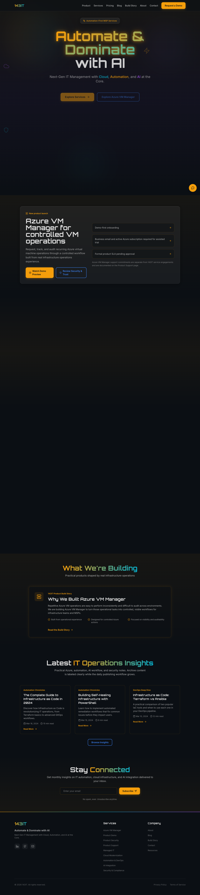
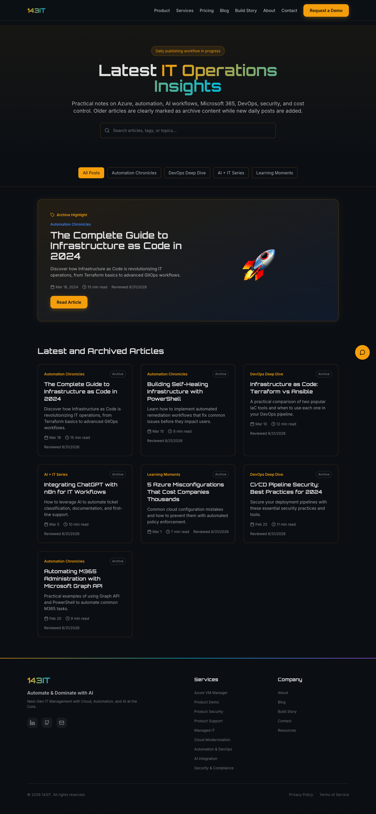
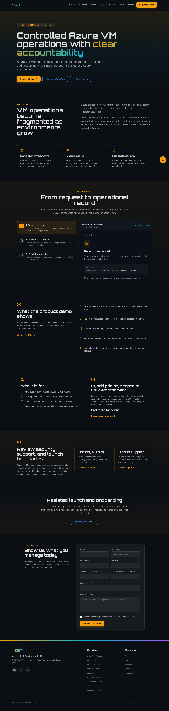
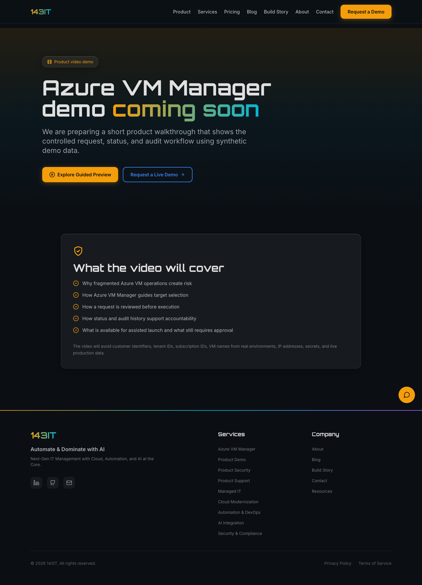

# 143IT Website

Modern Next.js website for **143IT** — an automation-first IT services company and the home of the **Azure VM Manager** product launch surface.

**Tagline:** Automate & Dominate with AI  
**Service area:** Remote, serving the United States and Canada  
**Support:** support@143it.com

## Website screenshots

| Home | Blog |
| --- | --- |
|  |  |

| Azure VM Manager | Video demo route |
| --- | --- |
|  |  |

## Current site focus

- 143IT service positioning across managed IT, cloud modernization, automation, DevOps, AI integration, and security.
- Azure VM Manager product launch pages with product overview, demo request, security model, support model, and video demo route.
- Daily blog publishing workflow for Azure operations, automation, Microsoft 365, DevOps, AI workflows, security, and cost control.
- n8n-backed lead capture for contact, newsletter, and Azure VM Manager demo requests.
- Production-ready Docker deployment path with a Next.js standalone build.

## Key routes

| Area | Route | Purpose |
| --- | --- | --- |
| Home | `/` | 143IT overview, services, product highlight, latest insights |
| Services | `/services` | Core service catalog |
| Azure VM Manager | `/products/azure-vm-manager` | Product positioning, workflow, demo request funnel |
| Product demo | `/products/azure-vm-manager/demo` | Video demo placeholder and script-aligned route |
| Product security | `/products/azure-vm-manager/security` | Security model, boundaries, review gates |
| Product support | `/products/azure-vm-manager/support` | Launch support model and support expectations |
| Blog | `/blog` | Daily IT operations insights and archived technical articles |
| RSS | `/feed.xml` | Blog syndication feed |
| Sitemap | `/sitemap.xml` | Search engine route discovery |
| Build story | `/case-studies` | Azure VM Manager build story |
| Contact | `/contact` | n8n-backed contact form |
| Pricing | `/pricing` | Discovery-led pricing information |

## Blog publishing workflow

The blog now uses a shared metadata catalog so the blog index, homepage cards, sitemap, and RSS feed stay aligned.

Core files:

- `lib/blog-posts.ts` — single source of truth for blog cards, categories, featured state, archive state, and sitemap/feed metadata
- `app/blog/<slug>/page.mdx` — MDX article content
- `components/BlogIndexClient.tsx` — searchable/filterable blog index
- `components/LatestInsights.tsx` — homepage latest insights cards
- `app/feed.xml/route.ts` — RSS feed
- `app/sitemap.ts` — sitemap generation
- `BLOG_DAILY_PUBLISHING.md` — daily publishing checklist
- `BLOG_POST_TEMPLATE.md` — reusable post template

Create a new post helper:

```bash
npm run blog:new -- "Post Title"
```

Daily publishing checklist:

- Create the MDX article under `app/blog/<slug>/page.mdx`.
- Add the post to `lib/blog-posts.ts`.
- Include `date`, `lastReviewed`, category, tags, excerpt, and read time.
- Add source links for technical claims that may change.
- Include a practical CTA to Azure VM Manager, consulting, or contact us for pricing.
- Run `npm run build` and `npm run check:links`.

## Tech stack

- **Framework:** Next.js 14 App Router
- **Language:** TypeScript
- **Styling:** TailwindCSS
- **Animation:** Framer Motion
- **Content:** MDX
- **Validation:** Zod
- **Icons:** Lucide React
- **Forms/workflows:** n8n webhooks
- **AI:** OpenAI-powered chat endpoint
- **Deployment:** Docker / Docker Compose / standalone Next.js output

## Environment variables

Create `.env.local` for local development:

```bash
OPENAI_API_KEY=your_openai_api_key_here
N8N_CONTACT_WEBHOOK=https://your-n8n-instance.com/webhook/contact
N8N_PRODUCT_DEMO_WEBHOOK=https://your-n8n-instance.com/webhook/product-demo
N8N_NEWSLETTER_WEBHOOK=https://your-n8n-instance.com/webhook/newsletter
```

## Local development

```bash
npm install
npm run dev
```

Open [http://localhost:3000](http://localhost:3000).

## Validation commands

```bash
npm run build
npm run check:links
```

The latest validated build generated these important routes:

- `/`
- `/blog`
- `/feed.xml`
- `/sitemap.xml`
- `/products/azure-vm-manager`
- `/products/azure-vm-manager/demo`
- `/products/azure-vm-manager/security`
- `/products/azure-vm-manager/support`

## Docker deployment

```bash
docker-compose up -d
docker-compose logs -f web
```

For a clean rebuild on a VPS:

```bash
docker-compose down
rm -rf .next node_modules
docker-compose build --no-cache
docker-compose up -d
docker-compose logs -f web
```

See `DEPLOYMENT.md`, `DOCKER_DEPLOYMENT_GUIDE.md`, and `VPS_DEPLOYMENT_CHECKLIST.md` for full deployment notes.

## Project structure

```text
143IT.com/
├── app/
│   ├── api/
│   ├── blog/
│   ├── products/azure-vm-manager/
│   ├── services/
│   ├── feed.xml/route.ts
│   ├── sitemap.ts
│   └── page.tsx
├── components/
├── lib/
│   ├── blog-posts.ts
│   ├── format-date.ts
│   ├── metadata.ts
│   └── rate-limit.ts
├── output/playwright/readme-screenshots/
├── scripts/
├── public/
├── Dockerfile
├── docker-compose.yml
└── package.json
```

## Documentation index

- `PRODUCT_LAUNCH_ROADMAP.md` — product launch roadmap
- `PRODUCT_LAUNCH_IMPLEMENTATION_CHECKLIST.md` — launch checklist
- `LAUNCH_QA_MATRIX.md` — QA coverage
- `PRODUCT_ANALYTICS_EVENT_PLAN.md` — analytics plan
- `AZURE_VM_MANAGER_VIDEO_DEMO_SCRIPT.md` — video demo script
- `BLOG_DAILY_PUBLISHING.md` — daily blog process
- `BLOG_POST_TEMPLATE.md` — daily article template

## Known follow-up items

- Add a favicon to avoid `/favicon.ico` 404s during browser checks.
- Add current 2026 daily posts so the new blog workflow has fresh content above the archived 2024 articles.
- Consider adding per-post Open Graph images once the daily content style stabilizes.

## Ownership

© 2026 143IT. All rights reserved.

Built and maintained by 143IT.
